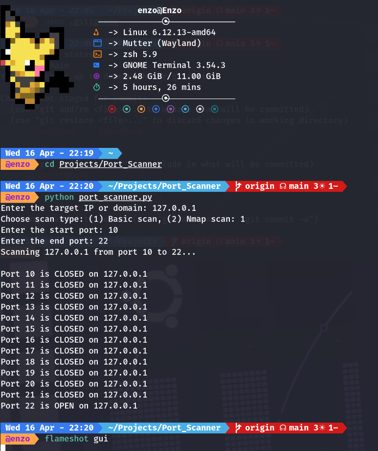
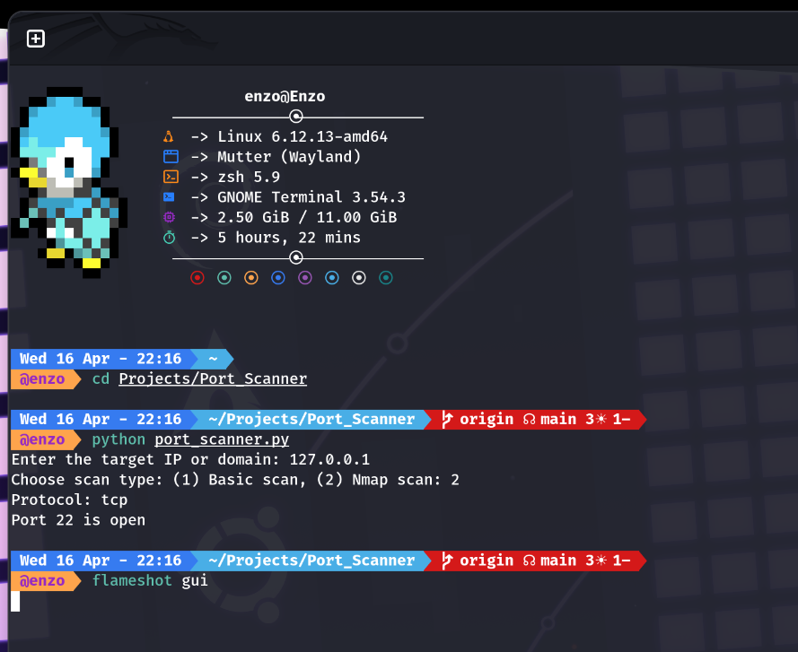

# Python Port Scanner

A simple port scanner written in Python that checks for open ports on a target system. The script uses the `socket` library for scanning and includes multithreading to speed up the process.

## 🚀 Features
- Scan a single IP or a range of IPs
- Check if specific ports are open or closed
- Use of threading for faster scanning

## 🛠 Tools Used
- Python (socket library)
- Multithreading

## 💻 Usage

```bash
python_port_scanner.py

## 📷 Screenshots

| Example Screenshot |
|--------------------|
|  | |  | 
